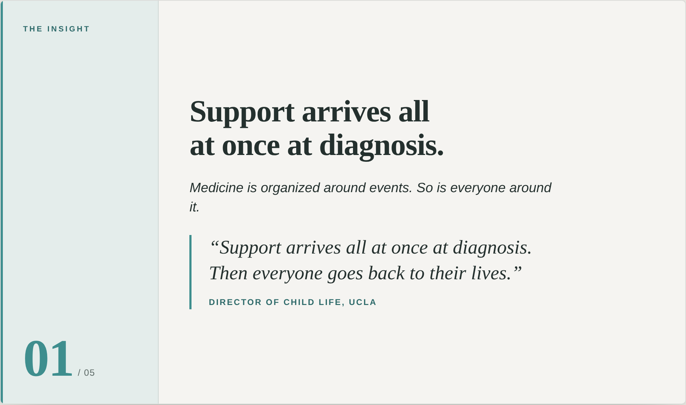
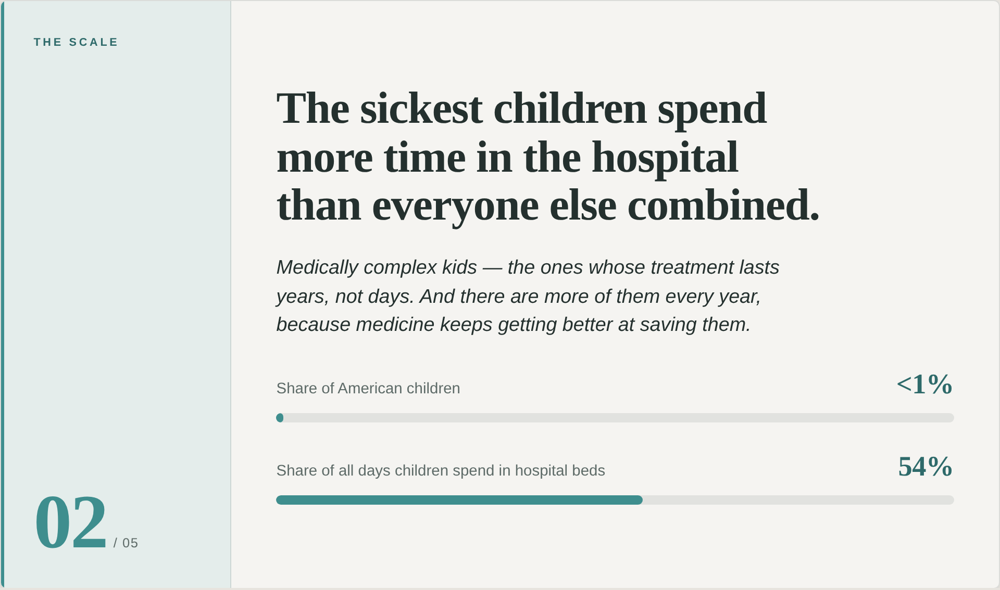
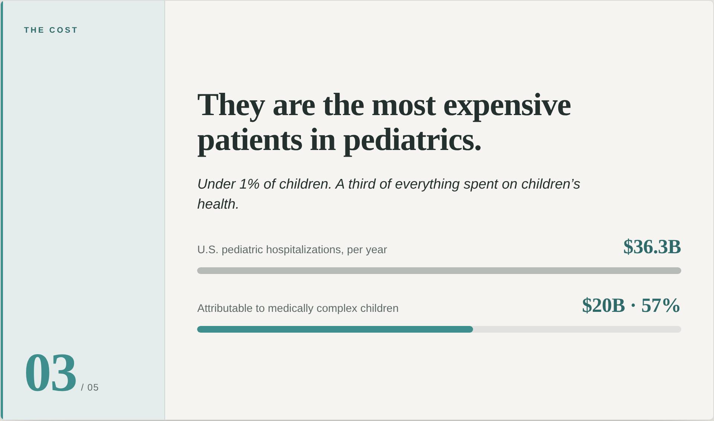
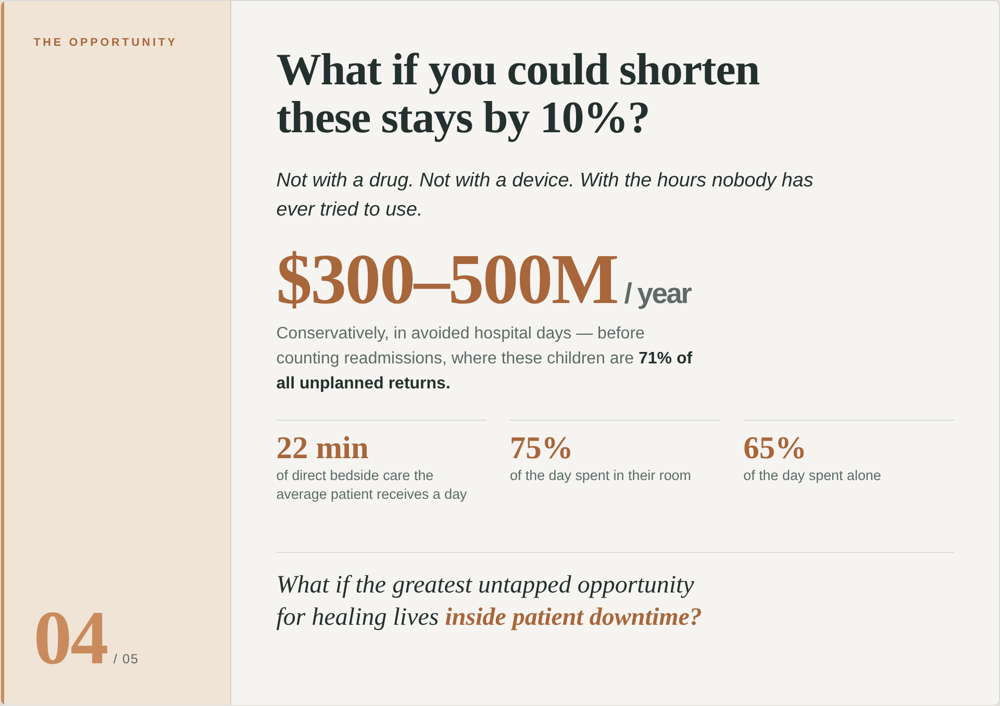
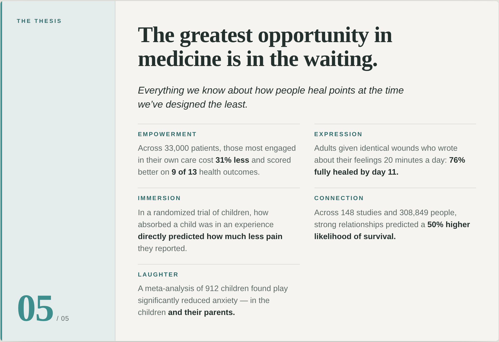

# Investor Deck — Look &amp; Feel Preview

Clean, minimal, text-led. Muted teal system on a warm off-white canvas; book-serif for the statements and pulled figures, humanist sans for everything else. Slides 01–05 follow the arc **Insight → Scale → Cost → Opportunity → Thesis**.

> These are rendered previews. The interactive HTML version is [`deck-preview.html`](deck-preview.html), and the design ports 1:1 into Beautiful.ai for the final editable file.

---

### 01 · The Insight

### 02 · The Scale

### 03 · The Cost

### 04 · The Opportunity

### 05 · The Thesis

---

**Palette** — Canvas `#F5F4F1` · Ink `#24302E` · Teal `#3E8E8E` / `#2E6A6A` · Warm accent `#C98B5E` (used only on slide 04, the pivot).
